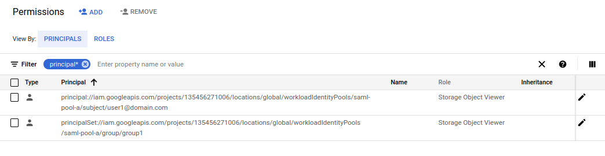
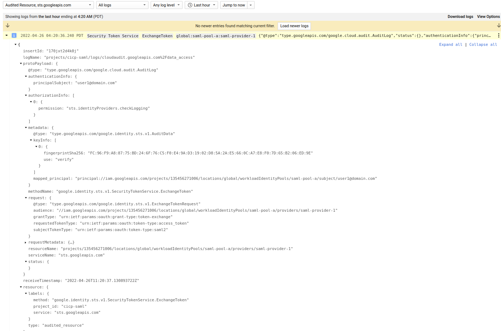
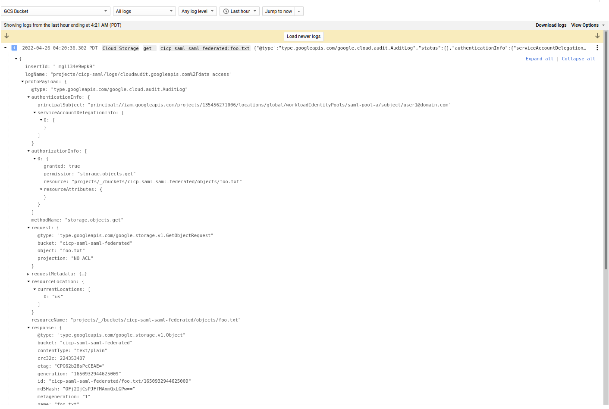

# GCP Workload Identity Federation using SAML Credentials

This is a sample procedure that will exchange a `SAML Assertion` for a `GCP credential` using [Workload Identity Federation](https://cloud.google.com/iam/docs/configuring-workload-identity-federation#saml)

You can use the GCP credential then to access any service the mapped principal has GCP IAM permissions on.

This article and repo is the third part that explores how to use the workload identity federation capability of GCP which allows for external principals (AWS,Azure or arbitrary OIDC provider, SAML) to map to a GCP credential.

The first two articles in this series are at

also see
- [GCP Workload Identity Federation using OIDC Credentials](https://github.com/salrashid123/gcpcompat-oidc)
- [GCP Workload Identity Federation using SAML Credentials](https://github.com/salrashid123/gcpcompat-saml)
- [GCP Workload Identity Federation using AWS Credentials](https://github.com/salrashid123/gcpcompat-aws)

And for reference, see: [Understanding workload identity federation](https://blog.salrashid.dev/articles/2021/understanding_workload_identity_federation/)


In this tutorial, we will 

- a) configure GCP Workload Federation to accept SAML assertions signed by provider.
- b) simulate a login to an IdP and acquire a SAML Assertion 
- c) exchange the SAML Assertion with GCP STS for a Federated Token
- d) access a GCP Service using the federated token

The flows first uses `curl` to do each step by hand.  Once thats shown, the final step will use a cloud client library to access GCP through application default credentials.


For the IdP, we will use a sample SAML server that wrote up almost a decade ago initially for the [Google Search Appliance](https://en.wikipedia.org/wiki/Google_Search_Appliance)...

Moreover, the idp is written in `python 2.7` needs a library for python xml digital signatures that ...well, probably won't compile anymore.  

Essentially, we need to run it in a docker container.  

For details about that, see [Simple SAML SSO server for Google Cloud and Apps](https://blog.salrashid.dev/articles/2016/gcp_saml/)


Anyway...

---

#### Configure identity pool provider.

Identify the projects and organization

```bash
export PROJECT_ID=`gcloud config get-value core/project`
export PROJECT_NUMBER=`gcloud projects describe $PROJECT_ID --format='value(projectNumber)'`
export ORGANIZATION_ID=1234567
```
First allow SAML providers through domain policy:  

[Manage constraints for workload identity federation](https://cloud.google.com/iam/docs/manage-workload-identity-pools-providers#restrict)

_To allow federation from from SAML identity providers, create a constraint allowing the special keyword KEY_UPLOAD._

```bash
gcloud resource-manager org-policies allow constraints/iam.workloadIdentityPoolProviders \
     KEY_UPLOAD --organization=ORGANIZATION_ID
```

In the project where you want to set this demo up

```bash
gcloud beta iam workload-identity-pools create saml-pool-a \
    --location="global" \
    --description="SAML Pool " \
    --display-name="SAML Pool" --project $PROJECT_ID

gcloud iam workload-identity-pools providers create-saml saml-provider-1 \
    --workload-identity-pool="saml-pool-a" \
    --location="global" \
    --idp-metadata-path="idp_metadata.xml" \
    --attribute-mapping="google.subject=assertion.subject,google.groups=assertion.attributes['groups']" --project $PROJECT_ID --billing-project=$PROJECT_ID
```

Note that in the configuration, we specify two things:

- 1) `idp_metadata.xml`:

```xml
<?xml version="1.0" encoding="UTF-8"?><md:EntityDescriptor xmlns:md="urn:oasis:names:tc:SAML:2.0:metadata" entityID="authn.py" validUntil="2026-12-16T17:18:02.000Z">
  <md:IDPSSODescriptor WantAuthnRequestsSigned="false" protocolSupportEnumeration="urn:oasis:names:tc:SAML:2.0:protocol">
    <md:KeyDescriptor use="signing">
      <ds:KeyInfo xmlns:ds="http://www.w3.org/2000/09/xmldsig#">
        <ds:X509Data>
          <ds:X509Certificate>MIIEPjCCAyag....</ds:X509Certificate>
        </ds:X509Data>
      </ds:KeyInfo>
    </md:KeyDescriptor>
    <md:NameIDFormat>urn:oasis:names:tc:SAML:1.1:nameid-format:emailAddress</md:NameIDFormat>
    <md:SingleSignOnService Binding="urn:oasis:names:tc:SAML:2.0:bindings:HTTP-Redirect" Location="https://sso.idpdomain.com:28080/login"/>
    <md:SingleSignOnService Binding="urn:oasis:names:tc:SAML:2.0:bindings:HTTP-POST" Location="https://sso.idpdomain.com:28080/login"/>
  </md:IDPSSODescriptor>
</md:EntityDescriptor>
```

This includes the public certificate that GCP will accept as well as the `NameIDFormat` it will see.

>> WARNING: if you follow this demo, it will use the certificates in this repo. It is highly recommended to delete/disable your workload federation config after you're done (its a demo after all..). 

If you want, you can reissue these certificates on your own by following [these instructions](https://github.com/salrashid123/ca_scratchpad).  Just remember to update `idp_metadata.xml` file with the new cert PEM

- 2) `attribute mapping`

 The second bit is the [attribute mapping](https://cloud.google.com/iam/docs/configuring-workload-identity-federation#mappings-and-conditions)

`google.subject=assertion.subject,google.groups=assertion.attributes['groups']`

The mapping basically tells gcp where to find the subject field and where a `groups` attribute exists.

To understand this, look at the raw SAML output in the appendix...specifically for `subject` see `<saml2:Subject> <saml2:NameID` and for `groups`, see `<saml2:AttributeStatement><saml2:Attribute Name="groups"`

#### Configure Resource

Create a test GCS bucket and give the user `user1@domain.com` access to it as well as anyone that has a SAML assertion attribute called `group` with a value of `group` access to this.   Basically, this allows user1 has access in two independent ways: directly by the `subject` binding and by `groups` membership


```bash
gsutil mb -b on gs://$PROJECT_ID-saml-federated
echo -n "foobar" > /tmp/foo.txt
gsutil cp /tmp/foo.txt gs://$PROJECT_ID-saml-federated

# bind on subject
gsutil iam ch \
    principal://iam.googleapis.com/projects/$PROJECT_NUMBER/locations/global/workloadIdentityPools/saml-pool-a/subject/user1@domain.com:objectViewer \
    gs://$PROJECT_ID-saml-federated

# bind on attribute value
gsutil iam ch \
   principalSet://iam.googleapis.com/projects/$PROJECT_NUMBER/locations/global/workloadIdentityPools/saml-pool-a/group/group1:objectViewer \
    gs://$PROJECT_ID-saml-federated
```



#### Acquire SAML Token

```bash
export SAML_TOKEN=`docker run -t -v $PWD:/app/:ro     --entrypoint=/app/getsamlassertion.py     salrashid123/appssso     --debug      --cert_file=/app/server.crt     --key_file=/app/server.key --user=user1@domain.com  --audience=//iam.googleapis.com/projects/135456271006/locations/global/workloadIdentityPools/saml-pool-a/providers/saml-provider-1`

echo $SAML_TOKEN
```

#### Exchange SAML Token for STS Token

Now that we have the SAML token, try to get a Federated Token

```bash
export FEDERATED_TOKEN=`curl -s -X POST    -d "grant_type=urn:ietf:params:oauth:grant-type:token-exchange" \
    -d "audience=//iam.googleapis.com/projects/$PROJECT_NUMBER/locations/global/workloadIdentityPools/saml-pool-a/providers/saml-provider-1"  \
      -d "subject_token_type=urn:ietf:params:oauth:token-type:saml2"    -d "requested_token_type=urn:ietf:params:oauth:token-type:access_token"  \
        -d "scope=https://www.googleapis.com/auth/cloud-platform"   --data-urlencode "subject_token=$SAML_TOKEN"     https://sts.googleapis.com/v1beta/token | jq -r '.access_token'`
echo $FEDERATED_TOKEN
```

#### Use federated token to access GCS

```bash
curl    -H "Authorization: Bearer $FEDERATED_TOKEN"  https://storage.googleapis.com/storage/v1/b/$PROJECT_ID-saml-federated/o/foo.txt
```


Since we bound user with a subject and groups (`group1`, `group2`), feel free to unbind the subject IAM policy on the GCS bucket.  What you should see is the user still has access (since the user is still allowed due to being in `group1`)


### Use Application Default Credentials

In this step, we will generate `Application Default Credentials` [configuration file](https://cloud.google.com/iam/docs/using-workload-identity-federation#generate-automatic).

```bash
gcloud iam workload-identity-pools create-cred-config \
    projects/$PROJECT_NUMBER/locations/global/workloadIdentityPools/saml-pool-a/providers/saml-provider-1 \
    --output-file=sts-creds.json \
    --credential-source-file="/tmp/samlassertation.txt" \
    --credential-source-type=text \
    --subject-token-type=urn:ietf:params:oauth:token-type:saml2
```

THis will create the ADC file

```json
{
  "type": "external_account",
  "audience": "//iam.googleapis.com/projects/135456271006/locations/global/workloadIdentityPools/saml-pool-a/providers/saml-provider-1",
  "subject_token_type": "urn:ietf:params:oauth:token-type:saml2",
  "token_url": "https://sts.googleapis.com/v1/token",
  "credential_source": {
    "file": "/tmp/samlassertation.txt",
    "format": {
      "type": "text"
    }
  }
}
```


Now pipe the saml assertion to a file

```bash
export SAML_TOKEN=`docker run -t -v $PWD:/app/:ro     --entrypoint=/app/getsamlassertion.py     salrashid123/appssso     --debug      --cert_file=/app/server.crt     --key_file=/app/server.key --user=user1@domain.com  --audience=//iam.googleapis.com/projects/135456271006/locations/global/workloadIdentityPools/saml-pool-a/providers/saml-provider-1`

echo $SAML_TOKEN

echo -n $SAML_TOKEN > /tmp/samlassertation.txt
```

finally access the object

```bash
export GOOGLE_APPLICATION_CREDENTIALS=`pwd`/sts-creds.json

go run main.go    --gcpBucket $PROJECT_ID-saml-federated   --gcpObjectName foo.txt
```

If you enabled audit logs, you'll see the sts and the identity transferred over





---

#### Appendix

Sample SAML Response:

```xml
<saml2p:Response ID="_1d7ff63fa5cd0c55a22d9c6f77f7b72" InResponseTo="_fd5c73f252cede1cca909a034fb4b6e" IssueInstant="2022-04-26T02:12:49Z" Version="2.0" xmlns:saml2p="urn:oasis:names:tc:SAML:2.0:protocol">
	<saml2:Issuer Format="urn:oasis:names:tc:SAML:2.0:nameid-format:entity" xmlns:saml2="urn:oasis:names:tc:SAML:2.0:assertion">authn.py</saml2:Issuer>
	<ds:Signature xmlns:ds="http://www.w3.org/2000/09/xmldsig#">
		<ds:SignedInfo>
			<ds:CanonicalizationMethod Algorithm="http://www.w3.org/2001/10/xml-exc-c14n#"/>
			<ds:SignatureMethod Algorithm="http://www.w3.org/2000/09/xmldsig#rsa-sha1"/>
			<ds:Reference URI="#_1d7ff63fa5cd0c55a22d9c6f77f7b72">
				<ds:Transforms>
					<ds:Transform Algorithm="http://www.w3.org/2000/09/xmldsig#enveloped-signature"/>
					<ds:Transform Algorithm="http://www.w3.org/2001/10/xml-exc-c14n#"/>
				</ds:Transforms>
				<ds:DigestMethod Algorithm="http://www.w3.org/2000/09/xmldsig#sha1"/>
				<ds:DigestValue>1fPBK5yvzt7V+T1EWrpCED/Ecqg=</ds:DigestValue>
			</ds:Reference>
		</ds:SignedInfo>
		<ds:SignatureValue>rqHhiiaQ2pdLmo8cQFTKocHI0oVUfkHpHRUgEcR8u3a6886CzJY26FXorFzxYyS3
Huro1nbx1bmsfQiYHUXq2Iwc7t0K8YN2MWK7XS+bLqZK8L5HgLiLVSDw0ND2BOsJ
QAFjs2roXTJlO2fMflqnZnQsM1DVLW/rKAgMjNjvQa/Ni6n1buwvh6MgwzjCRrg9
OG74H5GcOUhJNjvPC+bcTdpOU26qRRMn27cELETsJtetyXFPKy2WQJ+4ztk0mY7I
/TSYX3yZ/qsHG3vHQ45pdRVCKYNY1y5lBcKkwE3E1yHNlu+sSiEmRYAqiEI2CtRp
aua++AM+7T5wNcqoraQCzg==</ds:SignatureValue>
		<ds:KeyInfo>
			<ds:X509Data>
				

				<ds:X509Certificate>MIIEPjCCAyagAwIBAgIBATANBgkqhkiG9w0BAQsFADBXMQswCQYDVQQGEwJVUzEP
MA0GA1UECgwGR29vZ2xlMRMwEQYDVQQLDApFbnRlcnByaXNlMSIwIAYDVQQDDBlF
bnRlcnByaXNlIFN1Ym9yZGluYXRlIENBMB4XDTIyMDEwOTIyMTAzNloXDTI3MDcw
MjIyMTAzNlowUzELMAkGA1UEBhMCVVMxDzANBgNVBAoMBkdvb2dsZTETMBEGA1UE
CwwKRW50ZXJwcmlzZTEeMBwGA1UEAwwVc2VydmVyLnlvdXJkb21haW4uY29tMIIB
IjANBgkqhkiG9w0BAQEFAAOCAQ8AMIIBCgKCAQEAw0PQuP452qvSZetyW/hqFIkg
CCSc+6Ryw+rRPUIcVZIuibonJeSJe+TXPvonUEzAgpt858ji+FUsFVDsLmcX2yLF
DO0AtV3JA04wbJb8bSujvVstzpVAvY/gIAADrs8gqybekgSnUxOtXlFeYmYjxdNF
sx1qFqaE0nrRJzZIlarhaym38+Tta5+rJPlrZKOVoCgOqAYyQ5LH0/epEJh5U2Du
g2aZRcdULdqORbftDqqliheG2atd/tCQxKxVHQrRnWmnyE0ZJEpnn9/faSX8vqtz
Zu/5Z4FUt5TcyB9dyKrvaKjGwM6ON+5QYsKI08FxlqQ/Uhp5PrRFni5TCmfJWQID
AQABo4IBFzCCARMwDgYDVR0PAQH/BAQDAgeAMAkGA1UdEwQCMAAwEwYDVR0lBAww
CgYIKwYBBQUHAwEwHQYDVR0OBBYEFEmBqhsOJAb2CGD7SiVS0tnJbQNOMB8GA1Ud
IwQYMBaAFLe6sAKh5740xsEFXGZ45btTXaFUMEQGCCsGAQUFBwEBBDgwNjA0Bggr
BgEFBQcwAoYoaHR0cDovL3BraS5lc29kZW1vYXBwMi5jb20vY2EvdGxzLWNhLmNl
cjA5BgNVHR8EMjAwMC6gLKAqhihodHRwOi8vcGtpLmVzb2RlbW9hcHAyLmNvbS9j
YS90bHMtY2EuY3JsMCAGA1UdEQQZMBeCFXNlcnZlci55b3VyZG9tYWluLmNvbTAN
BgkqhkiG9w0BAQsFAAOCAQEAghT4lTRNTN95pVLFqvopmuOhxt+MJVzGeeIwOZCH
IP2GOWzucuHqxyhlvDHtDmJSGB4tsC5EExZ+nThQdNiLB0QfMzj+OHUQHeA3RQp5
NgK3/Cvhzjd0zptC9X2pFC1vIRdvS+qGQMUbre0gZ01WCrd6p4WDRy8rblB9aW7J
OVgo6zV+4yAgson4RYa70N7HlcWgwfYmlS6YhRNJKMJbjDSFj1aA8HkCoUQZlkES
VT642mI/pwjL2U6eEyDVL0v+2yeDAsP4Jg+TdjNXumbLiWYIDUVa19Eqaz4LeXB+
T1Y96kb1pfIDuUf92nSnoUmTn4cijwdub8WqlJXX9Q6RNw==</ds:X509Certificate>
				

			</ds:X509Data>
		</ds:KeyInfo>
	</ds:Signature>
	<saml2p:Status xmlns:saml2p="urn:oasis:names:tc:SAML:2.0:protocol">
		<saml2p:StatusCode Value="urn:oasis:names:tc:SAML:2.0:status:Success"/>
	</saml2p:Status>
	<saml2:Assertion ID="_110140b8f596cfc7772e93b1e2d69f9" IssueInstant="2022-04-26T02:12:49Z" Version="2.0" xmlns:saml2="urn:oasis:names:tc:SAML:2.0:assertion">
		<saml2:Issuer Format="urn:oasis:names:tc:SAML:2.0:nameid-format:entity">authn.py</saml2:Issuer>
		<saml2:Subject>
			<saml2:NameID Format="urn:oasis:names:tc:SAML:1.1:nameid-format:emailAddress">user1@domain.com</saml2:NameID>
			<saml2:SubjectConfirmation Method="urn:oasis:names:tc:SAML:2.0:cm:bearer">
				<saml2:SubjectConfirmationData InResponseTo="_fd5c73f252cede1cca909a034fb4b6e" NotOnOrAfter="2022-04-26T03:02:49Z" Recipient="//iam.googleapis.com/projects/135456271006/locations/global/workloadIdentityPools/saml-pool-a/providers/saml-provider-1"/>
			</saml2:SubjectConfirmation>
		</saml2:Subject>
		<saml2:Conditions NotBefore="2022-04-26T02:12:49Z" NotOnOrAfter="2022-04-26T03:02:49Z">
			<saml2:AudienceRestriction>
				<saml2:Audience>//iam.googleapis.com/projects/135456271006/locations/global/workloadIdentityPools/saml-pool-a/providers/saml-provider-1</saml2:Audience>
			</saml2:AudienceRestriction>
		</saml2:Conditions>
		<saml2:AuthnStatement AuthnInstant="2022-04-26T02:12:49Z" SessionIndex="_110140b8f596cfc7772e93b1e2d69f9">
			<saml2:AuthnContext>
				<saml2:AuthnContextClassRef>urn:oasis:names:tc:SAML:2.0:ac:classes:PasswordProtectedTransport</saml2:AuthnContextClassRef>
			</saml2:AuthnContext>
		</saml2:AuthnStatement>
		<saml2:AttributeStatement>
			<saml2:Attribute Name="groups" NameFormat="urn:oasis:names:tc:SAML:2.0:attrname-format:basic">
				<saml2:AttributeValue xmlns:xs="http://www.w3.org/2001/XMLSchema" xmlns:xsi="http://www.w3.org/2001/XMLSchema-instance" xsi:type="xs:string">group1</saml2:AttributeValue>
				<saml2:AttributeValue xmlns:xs="http://www.w3.org/2001/XMLSchema" xmlns:xsi="http://www.w3.org/2001/XMLSchema-instance" xsi:type="xs:string">group2</saml2:AttributeValue>
			</saml2:Attribute>
		</saml2:AttributeStatement>
	</saml2:Assertion>
</saml2p:Response>
```


